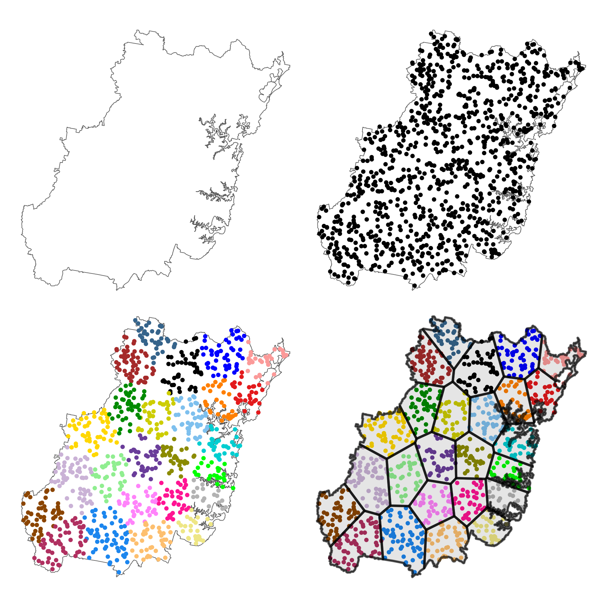
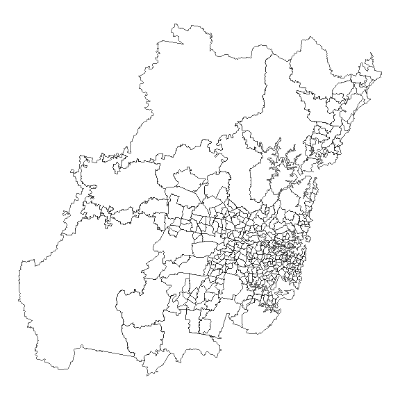
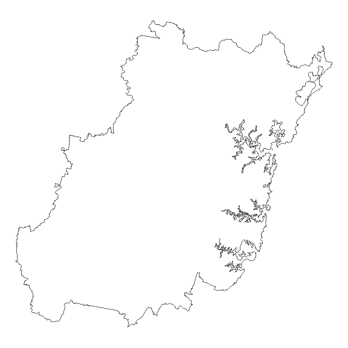
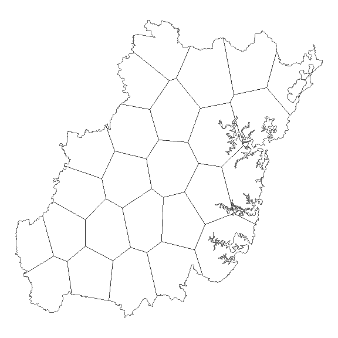
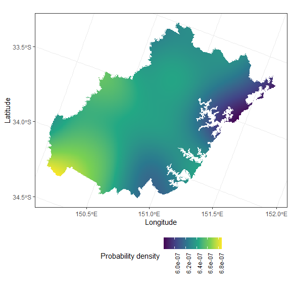

# gate 

Geospatial Analysis and Temporal Engineering

## Installation

You can install the development version of `gate` from GitHub using the
following:

``` r
devtools::install_github("hendersontrent/gate")
```

## Purpose

`gate` (Geospatial Analysis and Temporal Engineering) is a small (but
growing!) R package for performing a variety of spatio-temporal tasks
such as spatial resource optimisation. `gate` is very much still a work
in progress. Please check back soon for more!

## Current functionality

Currently, functionality is centred around a set of simple and intuitive
functions:

- `dissolve` – dissolve boundaries from multiply polygons into a single
  geometric polygon
- `segment` – divide an `sf` polygon into some number of approximately
  equally-sized segments and calculates the centroid coordinates of each
- `inside` – maps smaller polygons in one `sf` object to larger polygons
  in another `sf` object by area intersection
- `allocate` – allocates data based on lat-long coordinates to a polygon
  geometry
- `spatialkernel` – computes smoothed spatial kernel density estimation
  using data and geometry information
- `plot` – used for various tasks, but only currently plots geospatial
  kernel density results of `spatialkernel` in `ggplot2`

### On the segmentation algorithm

The segmentation procedure invoked by `segment` is a novel solution to
the problem of dividing any arbitrary polygon into $N$ number of
approximately equal segments. `gate` implements an old PostGIS solution
(but now coded in R) which broadly involves the following steps:

1.  Create sufficient random points inside a polygon
2.  Run *k*-means clustering over the random points
3.  Run [Voronoi](https://en.wikipedia.org/wiki/Voronoi_diagram)
    polygons over the clusters
4.  Clip Voronoi polygons to be within overall geometric boundaries

Below is a visual demonstration of the idea for the Greater Sydney
region of New South Wales in Australia (which has already had its
geographical boundaries dissolved using `dissolve`). Note that `gate` by
default uses $10,000$ points in `segment` (i.e., more is better), but
here only $1000$ are used for visual clarity.



### Indicative outputs

As a sample of the functionality, here is the geometry of the Greater
Sydney region in the state of New South Wales in Australia (which comes
with `gate`) with its existing [Statistical Area
2](https://www.abs.gov.au/statistics/standards/australian-statistical-geography-standard-asgs-edition-3/jul2021-jun2026/main-structure-and-greater-capital-city-statistical-areas/statistical-area-level-2)
boundaries:

``` r
library(gate)
library(ggplot2)

greater_sydney |>
  ggplot() +
  geom_sf(fill = "white") +
  theme_void()
```

<!-- -->

We can then `dissolve` Greater Sydney into a single polygon (which is
particularly useful for spatial optimisation problems where the
development of new spatial boundaries is a key component):

``` r
gs_dis <- dissolve(greater_sydney)

gs_dis |>
  ggplot() +
  geom_sf(fill = "white") +
  theme_void()
```

<!-- -->

We can then use `segment` to partition our new geometry into $N$ new
approximately equally-sized polygons which we could then use for any
number of spatial statistical tasks:

``` r
gs_seg <- segment(gs_dis, n_zones = 25, n_points = 1e4, seed = 123)

gs_seg |>
  ggplot() +
  geom_sf(fill = "white") +
  theme_void()
```

<!-- -->

Speaking of statistics, we can easily compute smoothed spatial kernel
density of some data stored in an `sf` object and subsequently plot it
using `ggplot2` with the generic `plot` function (which has been set up
to automatically handle objects created by `gate`). Here we will just
simulate some random data in the Greater Sydney geometry to demonstrate
the functionality:

``` r
pts <- sf::st_sample(gs_dis, size = 1e4) |> sf::st_as_sf()
kernel <- spatialkernel(data = pts, geometries = gs_dis)
plot(kernel)
```

<!-- -->
